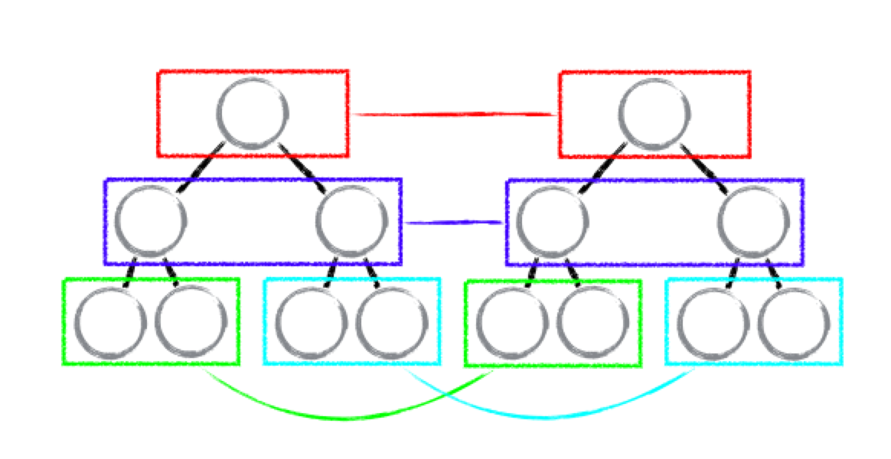

# diff 算法

## 传统 diff 算法
计算一棵树形结构转换成另一棵树形结构的最少操作，是一个复杂且值得研究的问题。
传统 diff 算法通过<b>循环递归</b>对节点进行依次对比，效率低下，算法复杂度达到 O(n^3)，其中 n 是树中节点的总数。
(O(n^3) 到底有多可怕，这意味着如果要展示1000个节点，就要依次执行上十亿次的比较。这种指数型的性能消耗对于前端渲染场景来说代价太高了！)

## react diff
diff 策略
Web UI 中 DOM 节点跨层级的移动操作特别少，可以忽略不计。

拥有相同类的两个组件将会生成相似的树形结构，拥有不同类的两个组件将会生成不同的树形结构。

对于同一层级的一组子节点，它们可以通过唯一 id 进行区分。

基于以上三个前提策略，React 分别对 tree diff、component diff 以及 element diff 进行算法优化，事实也证明这三个前提策略是合理且准确的，它保证了整体界面构建的性能。

### tree diff
基于策略一，React 对树的算法进行了简洁明了的优化，即对树进行分层比较，两棵树只会对同一层次的节点进行比较。

既然 DOM 节点跨层级的移动操作少到可以忽略不计，针对这一现象，React 通过 updateDepth 对 Virtual DOM 树进行层级控制，只会对相同颜色方框内的 DOM 节点进行比较，即同一个父节点下的所有子节点。当发现节点已经不存在，则该节点及其子节点会被完全删除掉，不会用于进一步的比较。这样只需要对树进行一次遍历，便能完成整个 DOM 树的比较。

当出现节点跨层级移动时，并不会移动操作，而是以移动的树被整个重新创建，这是一种影响 React 性能的操作，因此 React 官方建议不要进行 DOM 节点跨层级的操作。

### component diff
React 是基于组件构建应用的，对于组件间的比较所采取的策略也是简洁高效。

如果是同一类型的组件，按照原策略继续比较 virtual DOM tree。

如果不是，则将该组件判断为 dirty component，从而替换整个组件下的所有子节点。

对于同一类型的组件，有可能其 Virtual DOM 没有任何变化，如果能够确切的知道这点那可以节省大量的 diff 运算时间，因此 React 允许用户通过 shouldComponentUpdate() 来判断该组件是否需要进行 diff。

### element diff
当节点处于同一层级时，React diff 提供了三种节点操作，分别为：INSERT_MARKUP（插入）、MOVE_EXISTING（移动）和 REMOVE_NODE（删除）。

INSERT_MARKUP，新的 component 类型不在老集合里， 即是全新的节点，需要对新节点执行插入操作。

MOVE_EXISTING，在老集合有新 component 类型，且 element 是可更新的类型，generateComponentChildren 已调用 receiveComponent，这种情况下 prevChild=nextChild，就需要做移动操作，可以复用以前的 DOM 节点。

REMOVE_NODE，老 component 类型，在新集合里也有，但对应的 element 不同则不能直接复用和更新，需要执行删除操作，或者老 component 不在新集合里的，也需要执行删除操作。

## 总结
React 通过分层求异的策略，对 tree diff 进行算法优化；
React 通过相同类生成相似树形结构，不同类生成不同树形结构的策略，对 component diff 进行算法优化；
React 通过设置唯一 key的策略，对 element diff 进行算法优化；
在开发组件时，保持稳定的 DOM 结构会有助于性能的提升；
在开发过程中，尽量减少类似将最后一个节点移动到列表首部的操作，当节点数量过大或更新操作过于频繁时，在一定程度上会影响 React 的渲染性能。